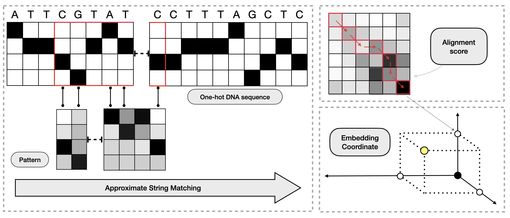

# AsMac
demo code of AsMac Algorithm

## 1. preparing training and testing data
Download `C++` library [SeqAn](https://github.com/seqan/seqan)
Or use the attached version:
```console
unzip seqan.zip
```

Compile the c++ code in folder CppAlign.
```console
cd CppAlign
g++ -I "seqan_library_dir" -std=c++1z -o align main.cpp read_fasta.cpp
```
Then generate alignment distance result for the input sequences.
```console
./align ../data/training_seq.fa 0
```
This might cost more than 1 day. The demo code use the finished result: training_dist_prepared.txt

## 2. Compile the Cython code for soft-NW algorithm.
```console
cd ..
python setup_softnw.py build_ext --inplace
```
This will compile the `_softnw.pyx` file to a `.so` file. This file is required to run the `jupyter-notebook` demo

## 3. Run the demo code
The algorithm demo is written in `Python 3.7`, model constructed by `torch 1.6.0`
Simply run the notebook file `demo.ipynb`

## 4. Reference
The code is a demo for the Continuous Sequence Matching model introduced in the paper:
[Predicting Alignment Distances via Continuous Sequence Matching](https://www.biorxiv.org/content/10.1101/2020.05.24.113852v2)
